# Toll Traffic ETL Pipeline

An automated **ETL (Extract, Transform, Load) data pipeline** built with **Apache Airflow** and **BashOperator** to process toll traffic data from multiple file formats.

This project demonstrates how raw data can be extracted, transformed, consolidated, and standardized through an orchestrated workflow using Apache Airflow.

---

## 📌 Project Overview

This project processes toll traffic data provided in multiple file formats:

- `.tgz` — compressed archive
- `.csv` — comma-separated values
- `.tsv` — tab-separated values
- `.txt` — fixed-width text data

The pipeline extracts relevant fields from each source, consolidates the extracted datasets, and transforms the final data into a standardized format.

The workflow is orchestrated using **Apache Airflow** and executed inside a **Docker Compose** environment.

---

## 🎯 Key Objectives

The main objectives of this project are:

- Build an automated ETL pipeline using Apache Airflow
- Process data from different file formats
- Use `BashOperator` to execute shell-based ETL operations
- Extract specific fields from raw datasets
- Consolidate multiple datasets into a single file
- Transform data into a standardized format
- Define task dependencies in Airflow
- Monitor and execute DAG runs
- Practice workflow orchestration using Docker

---

## 🏗️ Architecture

```text
                    Raw Toll Traffic Data
                            │
                            ▼
                    ┌───────────────┐
                    │ tolldata.tgz  │
                    └───────┬───────┘
                            │
                            ▼
                    ┌───────────────┐
                    │  unzip_data   │
                    └───────┬───────┘
                            │
             ┌──────────────┼──────────────┐
             │              │              │
             ▼              ▼              ▼
       vehicle-data.csv  tollplaza-  payment-data.txt
                          data.tsv  
             │              │              │
             ▼              ▼              ▼
       Extract CSV      Extract TSV     Extract Fixed Width
             │              │              │
             └──────────────┼──────────────┘
                            │
                            ▼
                    ┌───────────────┐
                    │  consolidate  │
                    │     _data     │
                    └───────┬───────┘
                            │
                            ▼
                    ┌───────────────┐
                    │ transform_data│
                    └───────┬───────┘
                            │
                            ▼
                   transformed_data.csv
```

---

## 🔄 ETL Workflow

The pipeline follows a sequential ETL process:

```text
┌────────────────────────────────┐
│          unzip_data            │
│       Extract raw dataset      │
└───────────────┬────────────────┘
                │
                ▼
┌────────────────────────────────┐
│      extract_data_from_csv     │
│        Extract CSV data        │
└───────────────┬────────────────┘
                │
                ▼
┌────────────────────────────────┐
│      extract_data_from_tsv     │
│        Extract TSV data        │
└───────────────┬────────────────┘
                │
                ▼
┌────────────────────────────────┐
│  extract_data_from_fixed_width │
│     Extract fixed-width data   │
└───────────────┬────────────────┘
                │
                ▼
┌────────────────────────────────┐
│       consolidate_data         │
│     Combine extracted data     │
└───────────────┬────────────────┘
                │
                ▼
┌────────────────────────────────┐
│         transform_data         │
│     Standardize text values    │
└────────────────────────────────┘
```

---

## ⚙️ ETL Tasks

### 1. `unzip_data`

Extracts the compressed toll traffic dataset from:

```text
data/raw/tolldata.tgz
```

The extracted files include:

```text
fileformats.txt
payment-data.txt
tollplaza-data.tsv
vehicle-data.csv
```

---

### 2. `extract_data_from_csv`

Extracts the following fields from `vehicle-data.csv`:

```text
Rowid
Timestamp
Anonymized Vehicle number
Vehicle type
```

Output:

```text
data/processed/csv_data.csv
```

---

### 3. `extract_data_from_tsv`

Extracts the following fields from `tollplaza-data.tsv`:

```text
Number of axles
Tollplaza id
Tollplaza code
```

The extracted TSV values are converted into comma-separated format.

Output:

```text
data/processed/tsv_data.csv
```

---

### 4. `extract_data_from_fixed_width`

Extracts the following fields from `payment-data.txt`:

```text
Type of Payment code
Vehicle Code
```

Because the source file uses fixed-width formatting, specific character positions are extracted using shell commands.

Output:

```text
data/processed/fixed_width_data.csv
```

---

### 5. `consolidate_data`

Combines the three processed datasets into a single file.

The final column order is:

```text
Rowid
Timestamp
Anonymized Vehicle number
Vehicle type
Number of axles
Tollplaza id
Tollplaza code
Type of Payment code
Vehicle Code
```

Output:

```text
data/processed/extracted_data.csv
```

Example:

```text
1,Thu Aug 19 21:54:38 2021,125094,car,2,4856,PC7C042B7,PTE,VC965
2,Sat Jul 31 04:09:44 2021,174434,car,2,4154,PC2C2EF9E,PTP,VC965
3,Sat Aug 14 17:19:04 2021,8538286,car,2,4070,PCEECA8B2,PTE,VC965
```

---

### 6. `transform_data`

Transforms the consolidated dataset into a standardized format by converting text values to uppercase.

Output:

```text
data/processed/transformed_data.csv
```

Example:

```text
1,THU AUG 19 21:54:38 2021,125094,CAR,2,4856,PC7C042B7,PTE,VC965
2,SAT JUL 31 04:09:44 2021,174434,CAR,2,4154,PC2C2EF9E,PTP,VC965
3,SAT AUG 14 17:19:04 2021,8538286,CAR,2,4070,PCEECA8B2,PTE,VC965
```

---

## 🛠️ Tech Stack

| Technology | Purpose |
|---|---|
| Python | DAG definition |
| Apache Airflow | Workflow orchestration |
| BashOperator | Execute ETL shell commands |
| Bash / Unix Commands | Data extraction and transformation |
| Docker Compose | Containerized Airflow environment |
| Git & GitHub | Version control and project management |
| VS Code | Development environment |

---

## 📂 Project Structure

```text
toll-traffic-etl-pipeline/
│
├── config/
│   └── airflow.cfg
│
├── dags/
│   └── ETL_toll_data.py
│
├── data/
│   ├── raw/
│   │   ├── fileformats.txt
│   │   ├── payment-data.txt
│   │   ├── tollplaza-data.tsv
│   │   ├── vehicle-data.csv
│   │   └── tolldata.tgz
│   │
│   └── processed/
│
├── screenshots/
│   ├── dag_args.png
│   ├── dag_definition.png
│   ├── dag_tasks.png
│   ├── dag_runs.png
│   ├── extract_data_from_csv.png
│   ├── extract_data_from_tsv.png
│   ├── extracted_data.png
│   ├── submit_dag.png
│   ├── task_pipeline.png
│   ├── transformed_data.png
│   ├── unpause_trigger_dag.png
│   └── unzip_data.png
│
├── scripts/
│
├── plugins/
│
├── logs/
│
├── .gitignore
├── docker-compose.yaml
└── README.md
```

---

## 🚀 How to Run

### 1. Clone the repository

```bash
git clone https://github.com/baywcksn/toll-traffic-etl-pipeline.git
cd toll-traffic-etl-pipeline
```

### 2. Start the Airflow environment

```bash
docker compose up -d
```

### 3. Check running containers

```bash
docker compose ps
```

Make sure the Airflow services are running successfully.

### 4. Check the DAG

```bash
docker compose exec airflow-worker airflow dags list
```

The DAG should appear as:

```text
ETL_toll_data
```

### 5. Check for DAG import errors

```bash
docker compose exec airflow-worker airflow dags list-import-errors
```

The expected result is no import errors.

### 6. Unpause the DAG

```bash
docker compose exec airflow-worker airflow dags unpause ETL_toll_data
```

### 7. Trigger the DAG

```bash
docker compose exec airflow-worker airflow dags trigger ETL_toll_data
```

### 8. Monitor DAG runs

```bash
docker compose exec airflow-worker airflow dags list-runs ETL_toll_data
```

A successful run should show:

```text
state
-----
success
```

---

## 📊 Pipeline Output

The final transformed dataset is generated at:

```text
data/processed/transformed_data.csv
```

Example output:

```text
1,THU AUG 19 21:54:38 2021,125094,CAR,2,4856,PC7C042B7,PTE,VC965
2,SAT JUL 31 04:09:44 2021,174434,CAR,2,4154,PC2C2EF9E,PTP,VC965
3,SAT AUG 14 17:19:04 2021,8538286,CAR,2,4070,PCEECA8B2,PTE,VC965
4,MON AUG  2 18:23:45 2021,5521221,CAR,2,4095,PC3E1512A,PTP,VC965
5,THU JUL 29 22:44:20 2021,3267767,CAR,2,4135,PCC943ECD,PTE,VC965
```

---

## 📸 Screenshots

### DAG Definition

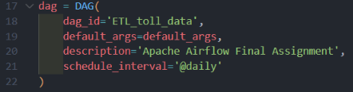

### DAG Task Pipeline

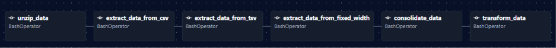

### CSV Extraction

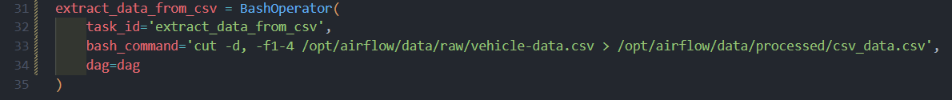

### TSV Extraction

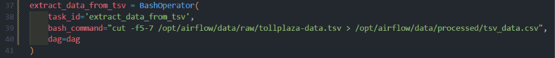

### Consolidated Data

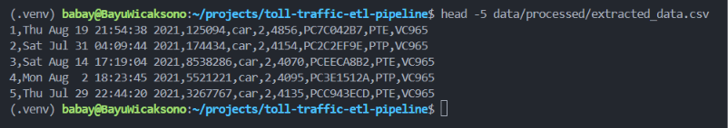

### Transformed Data

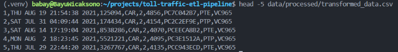

### DAG Submission

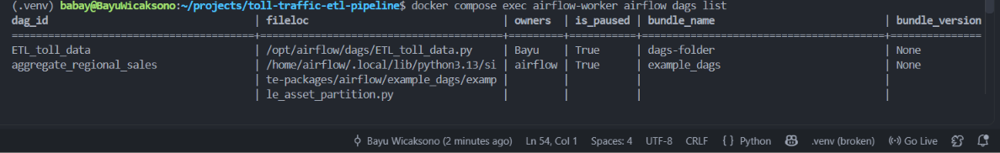

### Unpause and Trigger DAG

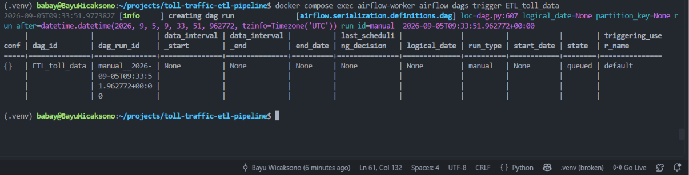

### DAG Tasks

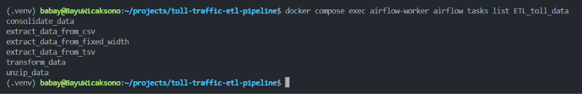

### DAG Runs

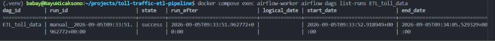

### Unzip Data

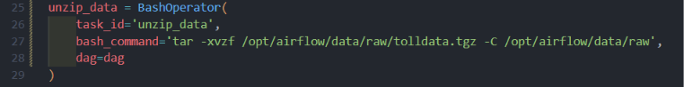

---

## 💡 Key Skills Demonstrated

- **ETL Pipeline Development**
- **Apache Airflow DAG Development**
- **Workflow Orchestration**
- **BashOperator**
- **Shell Scripting**
- **CSV Data Processing**
- **TSV Data Processing**
- **Fixed-Width Data Processing**
- **Data Consolidation**
- **Data Transformation**
- **Task Dependency Management**
- **Docker Compose**
- **Git & GitHub**
- **Pipeline Monitoring**

---

## 📚 Learning Outcomes

Through this project, I gained practical experience in:

1. Designing an ETL workflow using Apache Airflow.
2. Creating and configuring Airflow DAGs.
3. Using `BashOperator` to automate data processing tasks.
4. Processing datasets with different file formats.
5. Extracting specific fields from structured and fixed-width files.
6. Combining multiple datasets into a consolidated dataset.
7. Applying data transformation operations.
8. Defining dependencies between ETL tasks.
9. Running and monitoring DAG executions.
10. Managing an Airflow environment using Docker Compose.
11. Using Git and GitHub to manage and document a data engineering project.

---

## 🔮 Future Improvements

Potential improvements for this project include:

- Replace Bash-based transformations with Python operators.
- Introduce `PythonOperator` or TaskFlow API for more advanced transformations.
- Add data validation and quality checks.
- Add logging and error-handling mechanisms.
- Implement retries and failure notifications.
- Store transformed data in a relational database.
- Build a data warehouse using a star schema.
- Add automated testing for ETL tasks.
- Add CI/CD using GitHub Actions.
- Containerize the complete production workflow.
- Connect the pipeline to cloud storage or a cloud data warehouse.

---

## 👨‍💻 Author

**Bayu Wicaksono**

Information Systems Graduate | Aspiring Data Engineer

GitHub: [@baywcksn](https://github.com/baywcksn)

---

## 📌 Project Status

**Completed**

This project was developed as part of an Apache Airflow ETL learning project and further documented as a portfolio project to demonstrate practical data engineering skills.
